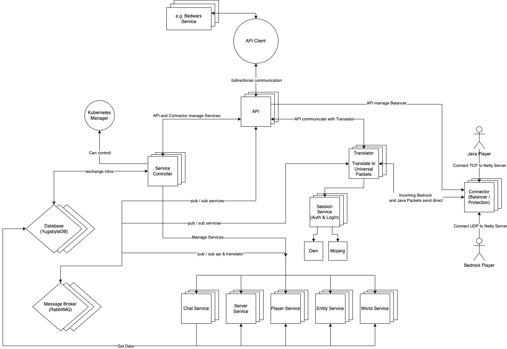

# Infos
> Infos about the project.

The goal is to develope a new Minecraft server according to modern standards. This means stateless design pattern and a implementation which should go in the direction of reactive microservices.

### Infos about the keywords:

- [Microservices](https://en.wikipedia.org/wiki/Microservices)
- [SOA](https://en.wikipedia.org/wiki/Service-oriented_architecture)
- [Reactive](https://en.wikipedia.org/wiki/Reactive_programming)
- [Reactive Microservices](https://www.lightbend.com/microservices/reactive-microservices-events-domain-driven-design-ddd)
- [Stateless](https://en.wikipedia.org/wiki/Service_statelessness_principle)

### Microservices trade-offs
The Notchain Minecraft server is not microservice or stateless, so the Minecraft client is not designed that way. That's why we have to change some things from the basic idea of microservices to SOA (service-oriented architecture).

### Stateless
Important Information: Everything runs stateless. No states. Only the database knows something.

### Plugins
Problems with a decentralized minecraft server but a central plugin and our way around it:
It is a small paradox to pull something apart only to make it centrally accessible again at the end. We have thought about this problem a lot and got stuck with our current solution. We don't have a direct connection between api, translator or mc services, this will only work through a message service like rabbitmq, we do this to continue the concept of asynchrony and not to introduce a complex system between client and server communication. 

## Goals:
+ better performance usage as the normal minecraft server
+ better security
+ handle more players with less hardware
+ more features, through better api architecture
+ better api for plugins, concept in the direction of Minestorm
+ imitate bigger servers, to be able to handle more players on the same server
+ better use of resources (cpu, memory, disk)
+ k8s deployment

Baisc idea for the technical stack:
[TECHSTACK](./TECHSTACK.md)

## Overviews:
Basic idea overview:

Overview:

Explaning the diffrent parts of the system:

- Connector: Here will the minecraft client connect to the server.
- Translator: Translates the packet from java or bedrock to a universal format. And send it into the message service.
- Message Service: The message service is the central point of the system. It will handle the communication between the api, the translator and the mc services.
- MC Services: On the mc services runs all important stuff like the world, the player, the inventory, the crafting, the chat, the command etc. for a actual minecraft server.
- API: The api is the interface between the services and the plugins.

More Explaning: 
- [API](./software-parts/api.md)
- [Services](./software-parts/services.md)
- [Service Controller](./software-parts/service-controller.md)
- [Connector](./software-parts/connector.md)
- [Translator](./software-parts/translator.md)
