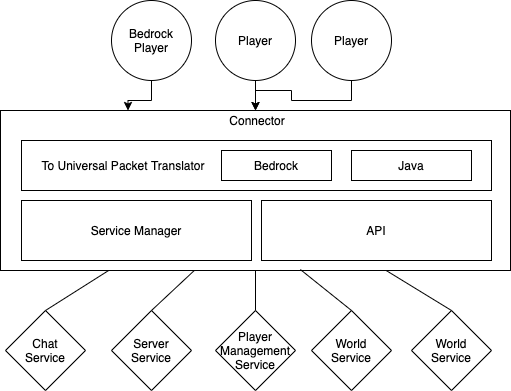

# Infos
Infos about the project.

The goal is a new development of the Minecraft server according to new standards and their implementation which should go in the direction of microservices.

Infos about microservices:

- [Microservices](https://en.wikipedia.org/wiki/Microservices)
- [Microservices DE](https://de.wikipedia.org/wiki/Microservices)

Unfortunatly, the Minecraft server is not a microservice. It is a monolithic application. Exactly the same as the minecraft client.
So, unfortunately, we have to deviate a bit from the concept of microservices.

Baisc idea for the technical stack:
[TECHSTACK](./TECHSTACK.md)

Idea as a diagram:

First Overview:

### Goals 
+ better performance usage as the normal minecraft server
+ better security
+ handle more players
+ more features
+ better api for plugins